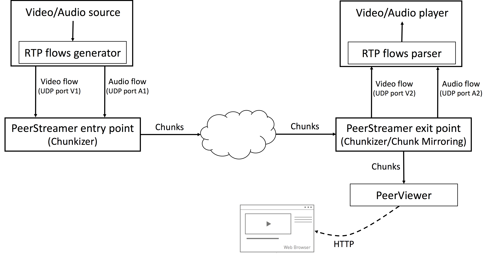
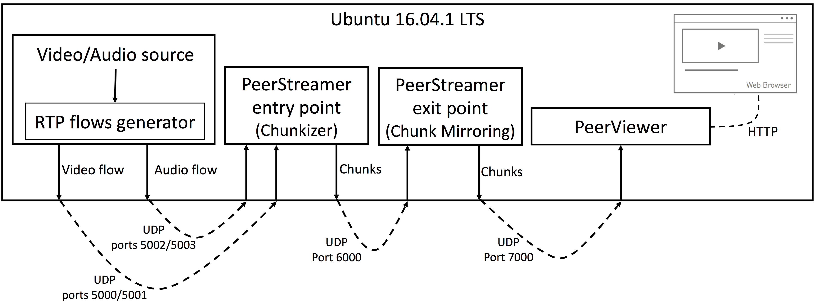
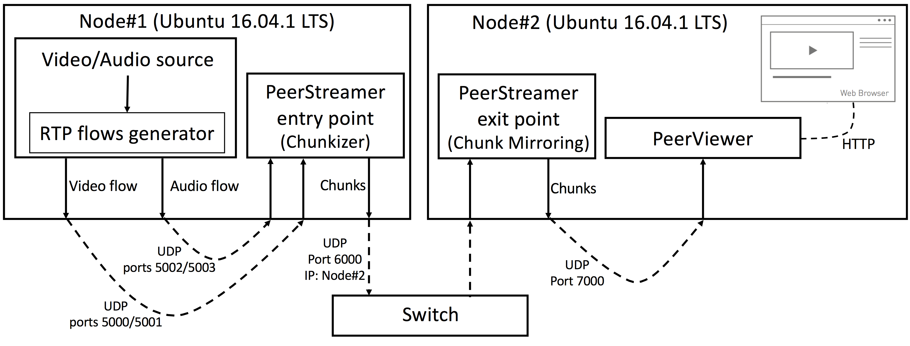
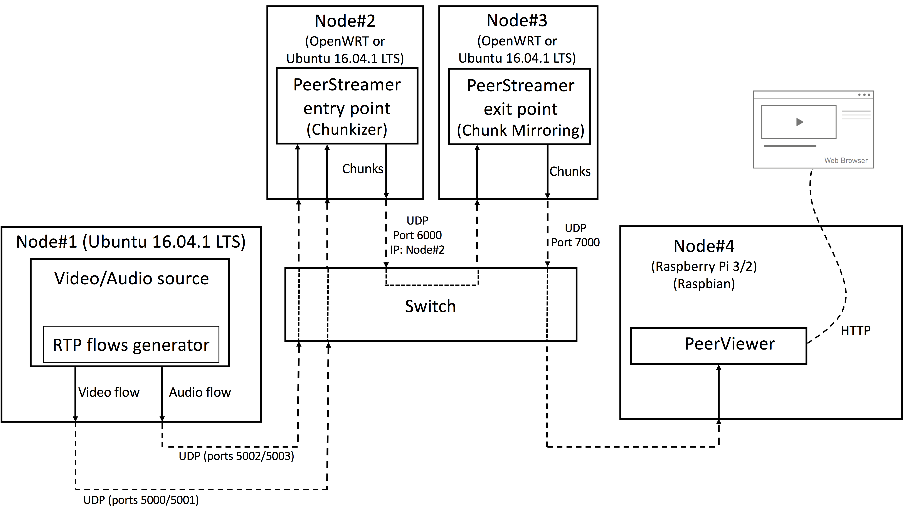

# Testing procedure for PeerStreamer

PeerStreamer for CNs is split in two applications, the streaming
engine that runs on a CN node, equipped with OpenWRT and a dedicated
device which runs PeerViewer, the web-based visualizer of the video.

In a typical configuration, the streaming engine written in C runs on
the router node, it does only the "chunk trading" function and requires
few computation resources. Another node runs PeerViewer, it can be a
PC, an embedded device such as a Raspberry. PeerViewer opens a web
interface where the video is streamed, anybody accessing the web interface
can watch the video.

To perform tests one needs to set-up the following testing environment,
in increasing complexity.

### High level software architecture

The figure reports a high level architecture of the software modules required
for running initial tests. PeerStreamer and PeerViewer are provided by the
University of Trento.
for the other modules, standard open source tools are used.

* Video/Audio source: for initial testing a file containing audio+video will be
  used. Currently supported format are: VP8 for video, Opus or MP3 for audio).
The University of Trento can provide the video testing files.

* RTP flows generator: any software capable of generating Video/Audio RTP/RTCP
  sessions (e.g., VLC, ffmpeg, GStreamer). The University of Trento will provide test examples with
GStreamer.

* PeerStreamer entry/exit points: peerstreamer software. The University of
  Trento will provide examples for building and executing it.

* RTP flows parser: when the PeerStreamer exit point is configured as a
  dechunkizer it will output the original RTP/RTCP sessions. In this case a
proper RTP/RTCP session parser is required (e.g., VLC, ffmpeg, GStreamer). The
University of Trento
will provide examples with GStreamer.

* Video/Audio Player: if the RTP flows parser is used, a proper player is
  required for reproducing the video in real time (e.g., ffplay, VLC).

* PeerViewer: this software is provided by the University of Trento and its purpose is to
  dechunkise
the chunks produced by the PeerStreamer exit point and converting them in an
HTTP flow which enables a web browser to reproduce the video/audio in real-time.
Any modern web browser can be used for this purpose. Most of the initial tests
will relies on PeerViewer for reproducing the multimedia content.
PeerViewer is written in Go.

## Simple testing, one host

As reported in the figure below, in the first test all the software modules run
on a single device and communicate through the loopback interface. For this test
a device running Ubuntu 16.04.1 LTS (x86_64) is required (other Ubuntu versions
or Linux distributions might be supported but have not been tested).

## Two-nodes testing

As reported in the figure below, for the second test the software modules are
split in two nodes. Both nodes must run Ubuntu 16.04.1 LTS (x86_64) and can
communicate to each other through a direct ethernet connection or through a
switch.

## Real network testing

For the real network test four nodes are required. Node#1 must run Ubuntu
16.04.1 LTS (x86_64) and is used for generating the RTP/RTCP sessions. Node#1 is
not strictly required. If required,/ the scenario can be modified to run the
Video/Audio source and the RTP flows generator directly on Node#2. For basic
tests, nodes #2 and #3, which are used for executing PeerStreamer must run Ubuntu
16.04.1 LTS (x86_64). For more advanced test nodes #2 and #3 must be devices
supported by OpenWRT/LEDE (Specific architecture requirements are coming soon).
Node#4 is a Raspberry pi 2 or 3 and it is used for running the PeerViewer
software. If required it is possible to substitute the Raspberry with any other
device/OS supported by Go (this include all the major operating systems:
Windows, OS X, any Linux distribution). There are not specific requirements for
the Web browser with the exception that it must be executed on a device that can
connect to node #4. The four nodes can be connected to each other through a
switch or in daisy chain (Node#1 connected to Node#2 which, in turn, is connected
to Node#3 which, in turn, is connected to Node #4).

## Expected feedbacks

### Before the tests

* Does the partner responsible for testing the PeerStreamer framework satisfy
  the hardware requirements described above?

* Does the partner responsible for testing the PeerStreamer framework agree with
  the software requirements described above (Linux distribution and version,
support software like RTP flows generator and video/audio source)?

* Any other question and doubt about the high level tests description provided
  above (More detailed guides for building and running the required software will
be provided).

### After the tests

* Qualitative considerations about the quality of real-time video playback.

* Opinions and feedbacks about the process for building and running the
  software, with a focus on PeerStreamer and PeerViewer.

