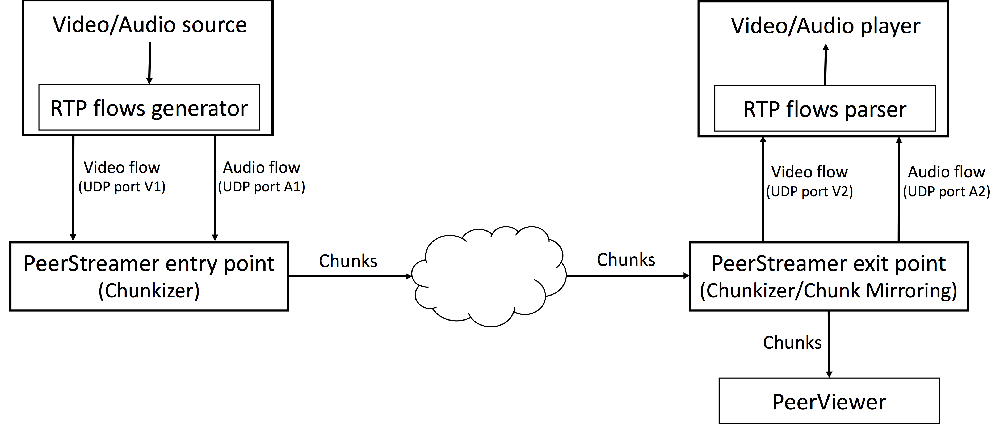

# Testing procedure for PeerStreamer

PeerStreamer for CNs is split in two applications, the streaming
engine that runs on a CN node, equipped with OpenWRT and a dedicated
device which runs PeerViewer, the web-based visualizer of the video.

In a typical configuration, the streaming engine written in C runs on
the router node, it does only the "chunk trading" function and requires
few computation resources. Another node runs PeerViewer, it can be a
PC, an embedded device such as a Raspberry. PeerViewer opens a web
interface where the video is streamed, anybody accessing the web interface
can watch the video.

To perform tests one needs to set-up the following testing environment,
in increasing complexity.

### High level software architecture

## Simple testing, one host

PeerStreamer framework testing on a single node requires a device running Ubuntu
16.04.1 LTS (other Ubuntu versions or Linux distributions might be supported but
have not been tested).

## Two-nodes testing

## Real network testing

## What to test

